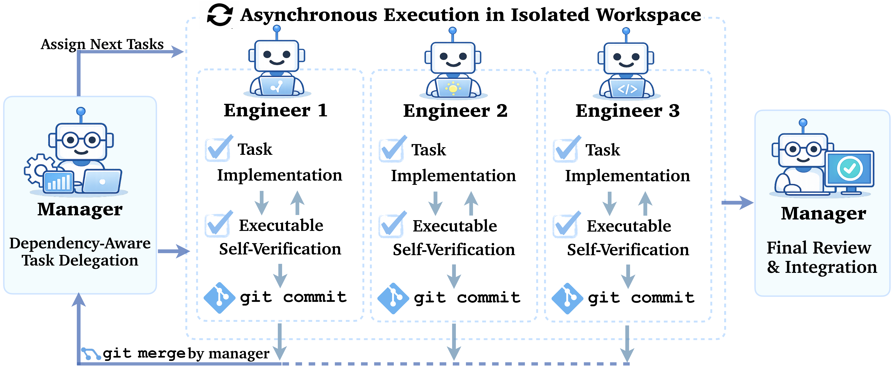

# Centralized Asynchronous Isolated Delegation (CAID)

> **Tutorial fork.** This is a clone of [JiayiGeng/CAID](https://github.com/JiayiGeng/CAID) enhanced with extensive onboarding documentation. The original code is unchanged. See **[docs/](docs/)** for the full documentation set.
>
> | | |
> |---|---|
> | [What is CAID?](docs/overview/what-is-this.md) | Mental model, architecture, how the pieces fit together |
> | [Quickstart](docs/getting-started/quickstart.md) | Running your first experiment in under 15 minutes |
> | [Workflow deep-dive](docs/concepts/workflow.md) | The 10-step pipeline explained step by step |
> | [Add a task](docs/guides/add-a-task.md) | Bring your own benchmark via the TaskModule interface |
> | [Configuration reference](docs/reference/configuration.md) | Every CLI argument and tunable parameter |
> | [Troubleshooting](docs/troubleshooting/common-issues.md) | Common failures and exact fix commands |

This repo contains the code for CAID, a multi-agent workflow where a central manager agent delegates tasks to multiple engineer agents to execute asynchronously in isolated git worktrees.

<p align="center">
  
</p>

## Setup

### Prerequisites

- Python >= 3.12
- [uv](https://docs.astral.sh/uv/) (Python package manager)
- [Docker](https://docs.docker.com/get-docker/) (required by OpenHands)

### Installation

```bash
# Clone the repository
git clone https://github.com/<your-org>/async-swe-agents.git
cd async-swe-agents

# Install dependencies
uv sync

# (Optional) Install visualization dependencies
uv sync --extra viz

# (Optional) Install development dependencies
uv sync --extra dev

# (Optional) Install PaperBench judge dependencies (see PaperBench Judge section below)
```

### Environment Variables

```bash
export LLM_BASE_URL=<your-proxy-url>
export LLM_API_KEY=<your-api-key>
```

## Prepare Data

Each task requires its own dataset under the `data/` directory.

### Commit0

Download the [commit0_combined](https://huggingface.co/datasets/wentingzhao/commit0_combined) dataset and place it at:

```
data/commit0/commit0_combined/
```

### PaperBench

Place the PaperBench [data](https://github.com/openai/frontier-evals/tree/main/project/paperbench/data) at:

```
data/paperbench/
├── papers/
│   ├── rice/
│   │   ├── config.yaml
│   │   ├── paper.pdf
│   │   ├── paper.md
│   │   ├── rubric.json
│   │   ├── addendum.md
│   │   ├── blacklist.txt
│   │   └── assets/
│   └── ...
└── src/
    └── paperbench/
        └── instructions/
            └── instructions.txt
```

#### PaperBench Judge

PaperBench evaluation requires the `paperbench` and `preparedness-turn-completer` packages from OpenAI's [frontier-evals](https://github.com/openai/frontier-evals) repo. These packages are not on PyPI, so install them directly:

```bash
git clone https://github.com/openai/frontier-evals.git
cd frontier-evals
uv pip install -e "project/paperbench"
uv pip install -e "project/preparedness_turn_completer"
```

## Running Experiments

Two shell scripts are provided under `scripts/` for running experiments. Edit the parameters at the top of each script (model, task, paper_id/repo, iterations, etc.) before running.

### Single-Agent Mode

```bash
bash scripts/run_single.sh
```

Runs a single agent that performs the entire task (implement all functions for Commit0, or reproduce the paper for PaperBench). Key parameters:

| Parameter | Description |
|-----------|-------------|
| `task` | `"commit0"` or `"paperbench"` |
| `model` | LiteLLM model identifier |
| `max_iterations` | Maximum LLM iterations for the agent |
| `repo` | (Commit0) Repository name |
| `paper_id` | (PaperBench) Paper identifier |

### Multi-Agent Mode

```bash
bash scripts/run_multi.sh
```

Runs the CAID (Centralized Asynchronous Isolated Delegation) multi-agent workflow: a manager agent delegates tasks to multiple engineer subagents working in parallel. Key parameters:

| Parameter | Description |
|-----------|-------------|
| `task` | `"commit0"` or `"paperbench"` |
| `model` | LiteLLM model identifier for the manager |
| `subagent_model` | Model for subagents (leave empty to use the same model) |
| `max_iterations` | Maximum LLM iterations for the manager |
| `max_subagents` | Number of parallel engineer subagents |
| `sub_iterations` | Maximum LLM iterations per subagent |
| `rounds_of_chat` | Maximum rounds of task assignment per engineer |

### Output

Results are saved to `outputs/<task>/<model>/<identifier>/<mode>/<params>/`, including:
- `cost.json` — token usage and cost breakdown
- `runtime.txt` — wall-clock runtime in seconds
- `outputs.jsonl` — structured event log
- `grade.json` — (PaperBench) judge evaluation results
- `report.json` — (Commit0) pytest results


## Adding a New Task

Each task is a self-contained file under `tasks/` that defines a config dataclass and a class that implements the `TaskModule` interface. See `tasks/commit0.py` or `tasks/paperbench.py` as examples.

### Steps

1. Create `tasks/my_task.py` with a `MyTaskConfig` dataclass for task-specific parameters (docker image, data paths, etc.) and a `MyTask` class that extends `TaskModule`.

2. Implement the six abstract methods defined in `tasks/base.py`:

   | Method | Purpose |
   |--------|---------|
   | `get_docker_image()` | Return the Docker image for the workspace container |
   | `get_work_dir()` | Return the working directory inside the container |
   | `get_workspace_config()` | Return a dict of parameters for workspace construction |
   | `load_task_data()` | Load task data from disk or dataset, store internally |
   | `setup_workspace(workspace)` | Prepare the container (clone repos, install deps, upload files) |
   | `evaluate(workspace)` | Run evaluation after the agent finishes, return a results dict |

3. Register in `tasks/__init__.py` by adding the import.

### Existing tasks

| Task | Description |
|------|-------------|
| `Commit0Task` | Implement functions in Python repos, evaluated via pytest |
| `PaperbenchTask` | Reproduce research papers, evaluated via reproduce.sh + LLM judge |


## Question and Issue
Please contact Jiayi Geng and Graham Neubig at `{ogeng,gneubig}cs.cmu.edu` for any questions or issues.


## Acknowledgements
This paper was supported by grants from Fujitsu. We thank Apurva Gandhi, Lintang Sutawika, Emmy Liu, and Howard Chen for their valuable feedback and discussion.
Special thanks to [OpenHands](https://docs.openhands.dev/sdk) for their open-source agent sdk framework, [Commit0](https://commit-0.github.io/) and [PaperBench](https://arxiv.org/pdf/2504.01848) for their benchmarks.

## Citation
```bibtex
@article{geng2026effective,
  title={Effective Strategies for Asynchronous Software Engineering Agents},
  author={Geng, Jiayi and Neubig, Graham},
  journal={arXiv preprint arXiv:2603.21489},
  year={2026}
}
```
